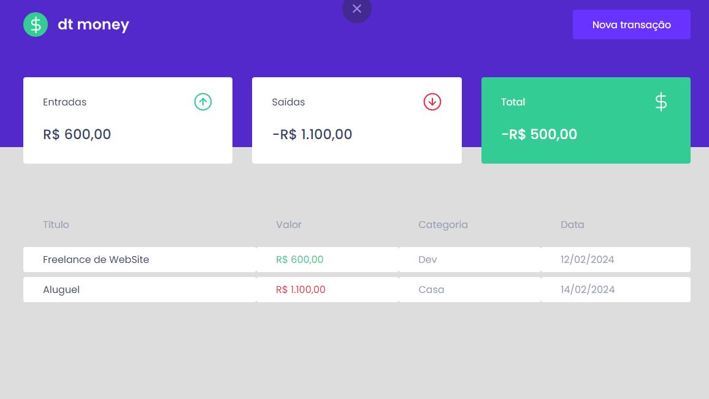
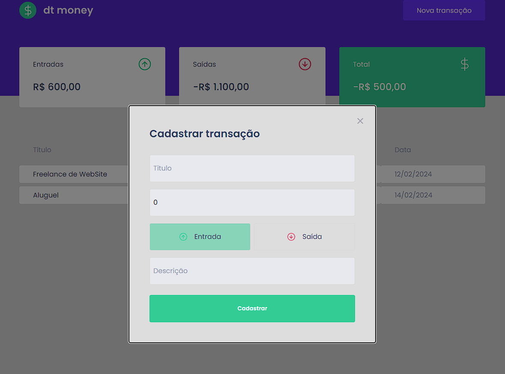

# 💰 DT Money
Aplicação de controle financeiro, desenvolvida na Trilha Ignite ReactJS da Rocketseat ❤, com foco em gerenciar suas entradas e saídas de forma simples, rápida e intuitiva.

🧠 Funcionalidades  
✅ Cadastro de transações (entradas e saídas).

📊 Resumo financeiro em tempo real.

🔎 Filtro e busca por transações.

🗂️ Persistência dos dados no localStorage.

🖥️ Layout e Páginas
## 🏠 Dashboard  
Visão geral das transações e resumo financeiro.

## ➕ Modal de Cadastro  
Formulário para adicionar uma nova transação.

## 🚀 Tecnologias Utilizadas  

⚛️ React JS – Biblioteca para construção da UI.

🔷 TypeScript – Tipagem estática.

💅 Styled-Components – Estilização dos componentes.

📦 Axios – Comunicação com API simulada (JSON Server).

🛠️ React Icons – Biblioteca de ícones.

♻️ Custom Hook – Gerenciamento global de transações.

🔥 Vite – Build tool super rápido.

🛠️ Como rodar o projeto localmente
bash
Copiar
Editar
# Clone este repositório
git clone https://github.com/nailsonlima/02_dtmoney_react-ignite

# Acesse a pasta do projeto
| Comando                         | Descrição                             |
| -----------------------------| ---------------------------------------- |
| `cd 02_dtmoney_react-ignite` | Acessa o diretório do projeto            |

# Instale as dependências & Rode o servidor de desenvolvimento
| Comando         | Descrição                                                  |
| ----------------| ---------------------------------------------------------- |
| `npm install`   | Instala as dependências                                    |
| `npm run dev`   | Executa o projeto no modo desenvolvimento                  |
Acesse: http://localhost:5173

🤝 Contribuição:  
Sinta-se à vontade para utilizar, melhorar e contribuir com este projeto. Toda sugestão é bem-vinda! 🚀

👨‍💻 Autor:  
Feito com dedicação por:
Nailson Lima 🚀

🎯 Agradecimento:  
Obrigado por acessar este projeto! 💜
